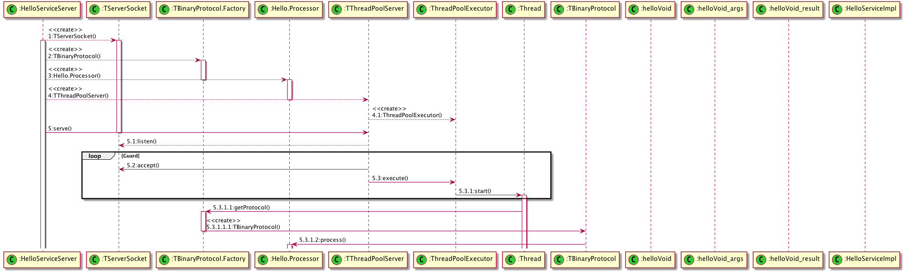

# Thrift Samples

## Thrift介绍

[Apache Thrift](https://thrift.apache.org)是一个由[facebook](https://facebook.com)开源的简单`RPC`框架,2007年`facebook`提交到[Apache基金会](https://apache.org)将`Thrift`作为一个开源项目，现在是一个`Apache`的顶级项目。

根据[Apache Thrift](https://thrift.apache.org)的官方描述，`Thrift`是一个：

> software framework, for scalable cross-language services developement, combines a software stack with a code generation engine to build services that work efficiently and seamlessly between C++, Java, Python, PHP, Ruby, Erlang, Perl, Haskell, C#, Cocoa, Javascript, Nodej.js, Smalltalk, OCaml and Delphi and other languages.

当时`facebook`创造`thrift`是为了解决`facebook`系统中各个系统之间大数据量的传输通信以及系统之间语言环境不同需要跨平台的特性。

`Thrift`适用于搭建大型书籍交换及存储的通用工具，对于大型系统中的内部数据传输对于`JSON`和`XML`来说，无论是性能、传输大小上都有明显的优势。


## Thrift支持的开发语言


> 图片来源 [Apache Thrift Language Support](https://thrift.apache.org/docs/Languages)

> Thrift支持许多编程语言，并且有一个令人印象深刻的测试套件，这个测试套件使用了大多数语言、协议和传输，表示数千种可能组合的矩阵。每种语言通常都有一个最低要求的版本以及支持库——有些是强制的，有些是可选的。下面提供了所有这些信息，以帮助您评估是否可以在项目中使用Apache Thrift。显然，这是一个需要维护的复杂矩阵，并且可能在所有情况下都不正确——如果您发现错误，请使用邮件列表通知开发人员。

> Apache Thrift可以选择两个构建系统。autoconf构建系统是最完整的构建，用于构建所有支持的语言。cmake构建系统已经被项目指定来替代autoconf，但是这个转换将需要相当长的时间来完成。

> 语言/库级别表示在用于Apache Thrift的持续集成环境(Appveyor, Travis)中使用的最小和最大版本。请注意，虽然语言可能包含对协议、传输和服务器的支持，但是作为整个构建过程的一部分对每种语言进行测试的程度各不相同。项目的最终集成测试称为“交叉”测试，它执行一个测试矩阵，客户端和服务器跨语言通信。

## 基本使用

### 安装

使用Thrift之前，需要先安装`Thrift`命令。

**macOS**

```bash
brew install thrift
```

**Linux**

```bash
apt-get install thrift-compiler
```

**Windows**

直接在[官网下载](https://thrift.apache.org/download)安装即可。

**更多安装方式**

[Thrift Install Documentation](https://thrift.apache.org/docs/install/)

## 基础架构

`Thrift`是一个服务端和客户端的架构体系，从我个人的观感上看`Thrift`是一个类似`XML-RPC` + `Java-to-IDL` + `Serialization Tools` = `Thrift`的东东。

`Thrift`具有自己内部定义的传输协议规范（`TProtocol`）和传输数据标准（`TTransports`），通过`IDL`脚本对传输数据的数据结构（`struct`）和传输数据的业务逻辑（`service`）根据不同的运行环境快速构建相应的代码，并通过自己内部序列化机制对传输的数据进行简化和压缩提高并发、大型系统中数据交互的成本。

我们从下面的图中那个可以看到`Thrift`的整体架构分为6个部分：

1. 你的业务逻辑实现（`Your Code`）
1. 客户端和服务端对应的`Service`
1. 执行读写操作的计算结果
1. `TProtocol`
1. `TTransports`
1. 底层`I/O`通信


## 时序图

### Server启动时序图



## 参考

- [TCP4J (Thrift Client Pool For Java)](https://github.com/tonydeng/tcp4j)
- [TCP4P (Thrift Client Pool For PHP)](https://github.com/tonydeng/tcp4p)
- [tonydeng/thrift-demo](https://github.com/tonydeng/thrift-demo)